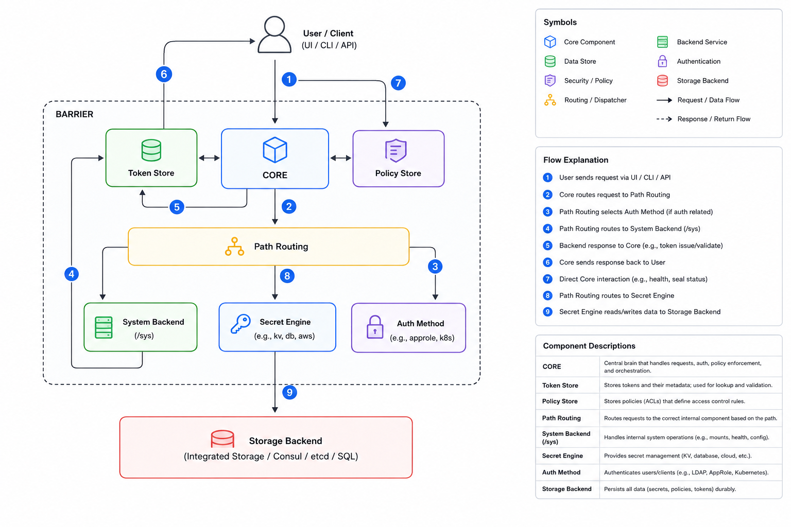

# Architecture - Internals

## Important Components

### CORE

The central orchestrator of Vault. Every request passes through Core — it handles token validation, policy enforcement, and coordinates between all other components. It is the only component that communicates directly with the Storage Backend, and it sits behind the encryption barrier, meaning nothing reaches it until Vault is unsealed.

### Token Store

Stores all active tokens and their metadata (TTL, policies, parent token). Every successful login produces a token, and that token is validated by Core on every subsequent request. Tokens can have a parent-child hierarchy — revoking a parent cascades to all its children.

### Policy Store

Stores all HCL policy objects. Policies define what capabilities (read, write, delete, list, sudo) are allowed on which paths. They follow a default-deny model — if a path isn't explicitly allowed, access is denied. Policies are attached to tokens at login time and checked by Core on every request.

### Path Routing

Routes incoming requests to the correct backend based on the request path. Vault maintains a mount table that maps path prefixes to backends — for example, `secret/` to a KV engine, `auth/kubernetes/` to the Kubernetes auth method. Path Routing consults this table and dispatches accordingly.

### Auth Methods

Pluggable authentication backends. The right method depends on who or what is authenticating:

| Client type | Typical auth method |
|---|---|
| Human users | Userpass, Okta, LDAP |
| Kubernetes workloads | Kubernetes |
| Applications / CI | AppRole |
| Cloud workloads | AWS, GCP, Azure |

On success, the auth method returns an identity back to Core, which then mints a token with the appropriate policies attached.

### Secret Engines

Backends that handle secret lifecycle. Each engine is mounted at a path and operates independently. Common types:

- **KV** — static key-value storage (v1 and v2)
- **Database** — dynamic credentials with short TTLs
- **PKI** — certificate issuance
- **SSH** — signed SSH certificates or OTPs
- **Kubernetes** — dynamic service account tokens

Dynamic engines generate credentials on demand and revoke them automatically on lease expiry — no long-lived credentials sitting in config files.

### System Backend

A built-in backend mounted at `/sys`. This is where Vault's own configuration lives — mount management, audit device config, seal/unseal operations, health endpoints, and license info. Operators interact with `/sys` to manage the Vault cluster itself, not secrets.

### Storage Backend

The physical persistence layer. Vault encrypts everything before writing here — the storage backend never sees plaintext. The backend choice affects availability and performance, not security.

Supported options:

- **Integrated Raft** — built-in, no external dependency, recommended default
- **Consul** — older default, still widely used
- **etcd / SQL** — supported but less common

Switching backends requires `vault operator migrate`.

---

## Request Flow

Two distinct flows depending on what the client is doing:

**Getting a token (login):**

1. Client sends credentials to an auth path (e.g. `POST /v1/auth/kubernetes/login`)
2. Core forwards to **Path Routing** → **Auth Method**
3. Auth Method validates credentials against the external provider
4. On success, Core mints a token with policies attached and returns it to the client

**Reading a secret (after login):**

1. Client sends request with token (e.g. `GET /v1/secret/data/myapp`)
2. Core validates the token against **Token Store**
3. Core checks the token's policies against **Policy Store** — does this token allow `read` on this path?
4. If allowed, Core routes via **Path Routing** → **Secret Engine**
5. Secret Engine reads from **Storage Backend** (decrypted by Core) and returns data to the client

---

## Encryption Barrier

Everything in the diagram inside the dashed boundary sits behind an encryption barrier. The barrier key is loaded at startup via Shamir key shares or auto-unseal (AWS KMS, GCP KMS, etc.). Until unsealed, Vault rejects all requests — a freshly restarted node must be unsealed before it serves traffic.
