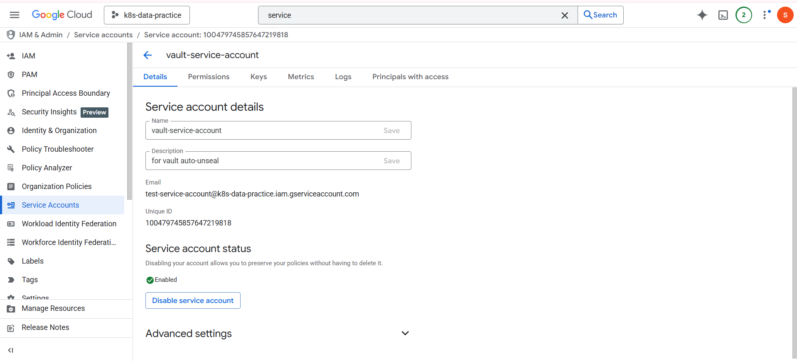
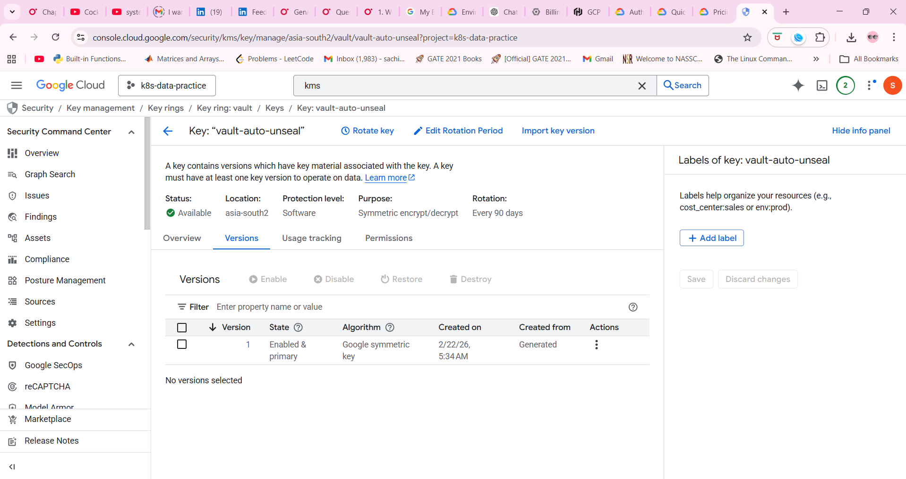
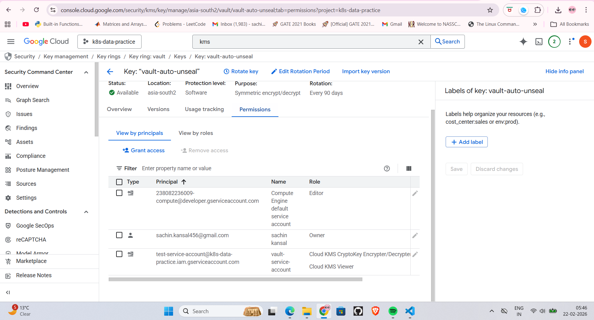
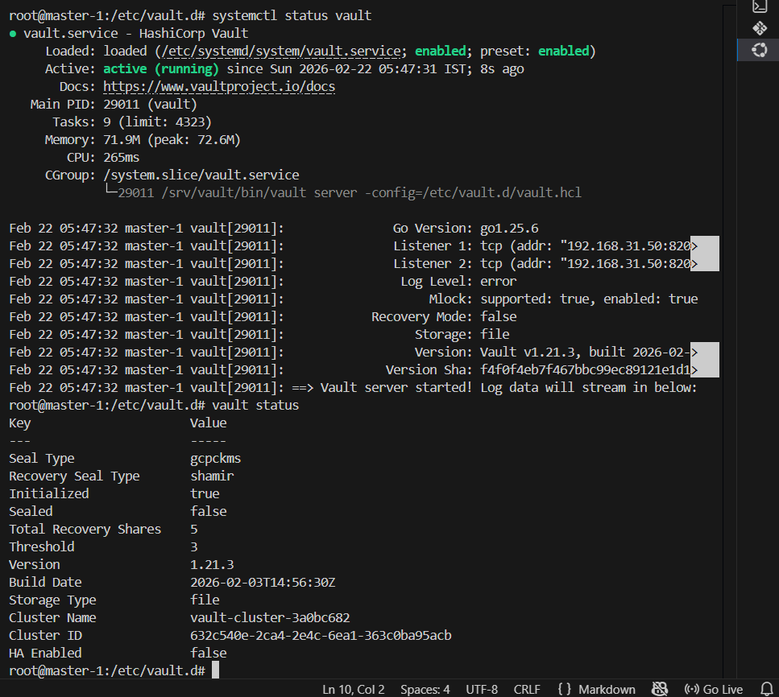

# Vault Auto Unseal GCP
## Migrate shamir sealed vault to gcp autounseal

### create a gcp service account
> Service accounts have zero cost in gcp


Store the generated service account key on secure location onserver as our vault is on-prem  it require to do authentication to cloud using this key.json.

we need to make sure key.json has minimal permission and the ownership to vault

### ROLES

We need to grant the following Roles to the created service account to encrypt/decrypt the keys.

- Cloud KMS CryptoKey Encrypter/Decrypter
- Cloud KMS Viewer

## Create key ring and key




## update vault.hcl

In Vault.hcl add the following block containing the information regarding how to connect and authenticate to the gcp cloud account and which kms key ring it need to use to generate the seal keys.

```hcl
seal "gcpckms" {
  project     = "k8s-data-practice"
  region      = "asia-south2"
  key_ring    = "vault"
  crypto_key  = "vault-auto-unseal"
  credentials = "/srv/vault/key.json"
}
```

### restart the vault

```bash 
systemctl restart vault
```

## migrate from shamir to gcpckms

```bash
vault operator unseal -migrate
```

provide seal keys until thresold is reached and vault is unsealed. this unsealing is one time activity and is required as our storage backened still think of it as shamir.

post migrate restart the cluster and this time it will be auto unsealed



NOTE: you see the recovery keys are still mentioned as they are still valid and useful incase of disater recovery or critical issue.

For each restart the keys are taken from cloud hence the cost of using kms is incurred. to prevent the cost remigrate from auto-unseal to shamir

## downgrade from gcp auto unseal to manual shamir 

update config 
```hcl
seal "gcpckms" {
  project     = "k8s-data-practice"
  region      = "asia-south2"
  key_ring    = "vault"
  crypto_key  = "vault-auto-unseal"
  credentials = "/srv/vault/key.json"
  disabled = "true"
}

shamir {}
```

restart the vault using `systemctl restart vault`

`vault operator unseal -migrate`
provide keys until threshold i.e. 3

again restart the vault now auto unseal is disable. 

remove the gcpckms block from .hcl , delete the key.json file and delete the keyring and key if not required.

As deletion of keys take 30 days of time. you can remove the permission for the keys so no one can use it.

