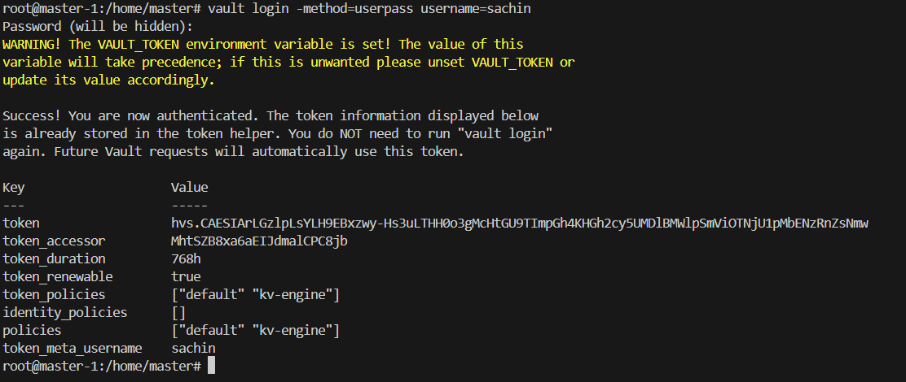
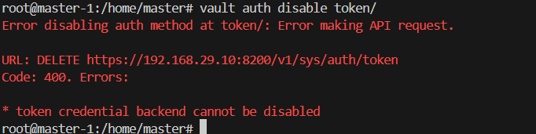
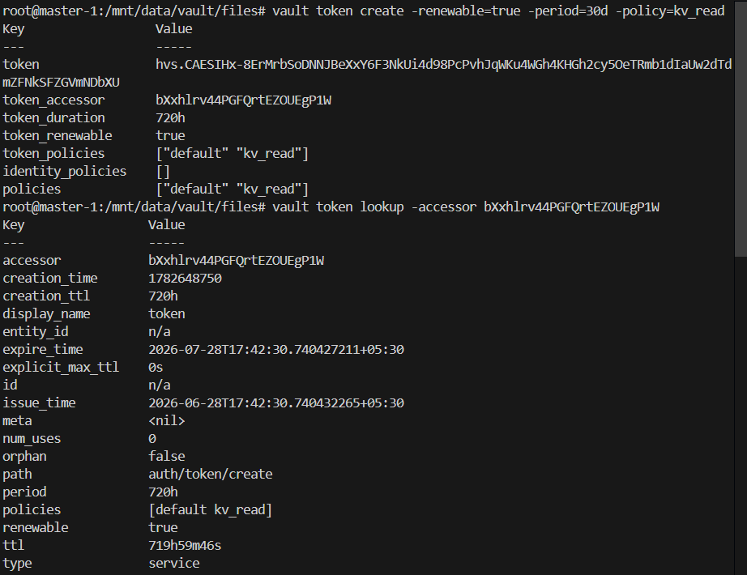
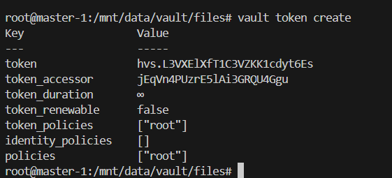
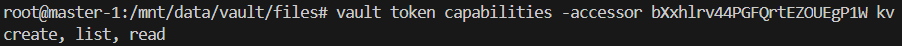
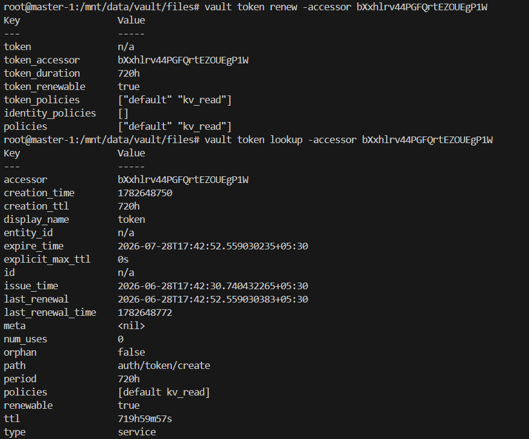
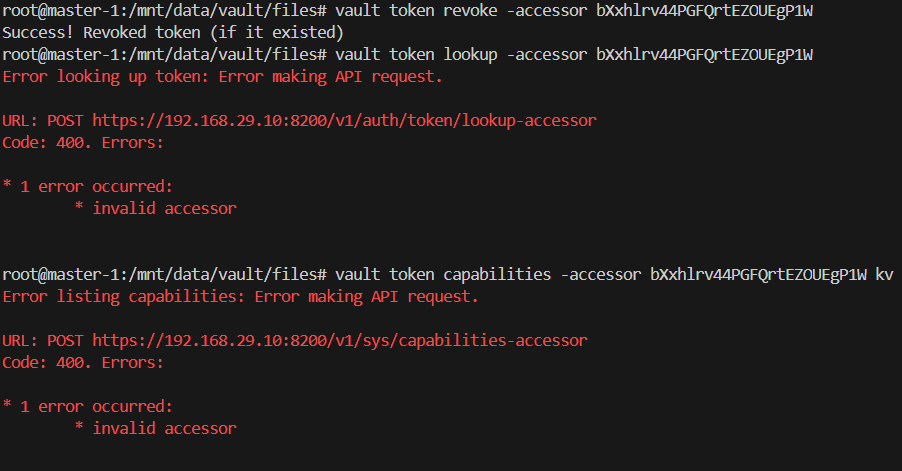

# Tokens Overview

***No token should be left active***

Tokens are the primary credentials used by Vault for authorization and session management. While users may authenticate through mechanisms such as UserPass, AppRole, Kubernetes, LDAP, or OIDC, Vault ultimately issues a token that represents the authenticated identity. These tokens are managed by Vault's internal token store, which is responsible for token creation, validation, renewal, and revocation.

As it can be seen in the image even though user logged in using UserPass mechanism a temporary token is generated which is valid for the user current session, if user re-logins via UI or Api request a new temporary token will be generated. ***This  proves the importance of tokens and tokenstore in the vault***

> Token auth method can not be disabled

# Components of Tokens

Every token consist of a token_accessor to access the token, the token duration aka time to live the time after which it expires and becomes invalid, policies which define what user/app can do using this token, identity policies if mapped to a identity mentioning the access granted to the identity and other metadata and properties which grant it extra functionality that could be ability to be renewed, dependency on parent token or being a orphan with full independence, how many times it can be used

property/options defining them are as follows:

- ttl
- type
- use-limit
- role
- renewable
- policy
- period (periodic token ) never expire explicit-max-ttl
- orphan
- no-default-policy
- entity-alias
- display-name

The tokens in general can be of various types depending on the UseCase:

1. Service Token 
 > used by mostly services and applications
2. Batch Token
 > for applications with high throughput and iops which could impact the overall performance of vault.
3. Root token
 > default admin token generated during init. must be revoked in production setup and regenerate in case of emergencies
4. Periodic Token
 > Tokens which should or needs to be renewed before their expiry
5. Child Token
 > The token derived from some other token(parent token). these tokens gets their default properties from parents which can be override while creation. These token also becomes invalid if parents is revoked so in case of breach rather revoking the multiple child tokens a parent can be  revoked and all their children will be revoked in a go.
6. Orphan Token
 > Token who has no parent. these token are independent in nature and does not depend on any other tokens max ttl
7. Wrapped Token
 > Tokens which are wrapped in an encryption. this make sharing the secrets easier and safer as the shared secrets are wrapped in an encryption when reached the end user can be decrypted by them for further use.

# Token Life Cycle

1. vault token generated with some policy

> when a token is created the policy is attached to grant capabilities defining what the token can do. And a default policy are granted to the token by default. if no policy is defined during token creation then the parent policies are applied.

what if a token is created without any passing any policy via root token ??

> the token created will be a new root token. with root policy attached

2. vault token used to perform action according to its capabilities

3. vault token can be renewed if renewable

> the token can be renewed is periodic token are created until either its period is exceeded or the time to live is ended.

as you can see in the image below. after renewal the ttl got reset and last renewal time is added which tells when was the last time token ttl was renewed and expiry time is increased as the token is recently renewed.

4. vault token revoked

> once token is revoked either manually or on its expiry it looses all capabilities and you can see is not usable anymore. vault throws an error if the revoked tokens are used.

