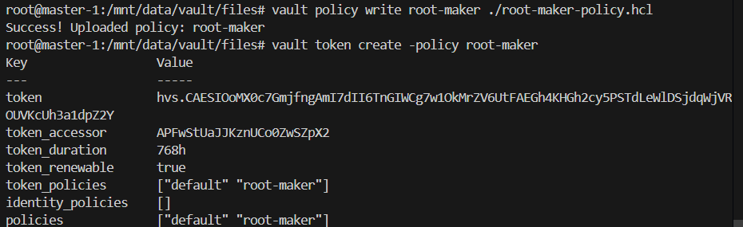
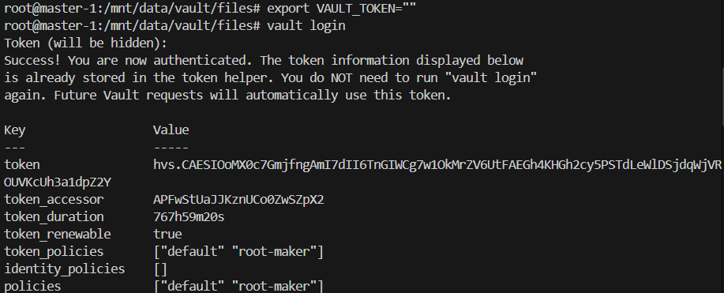
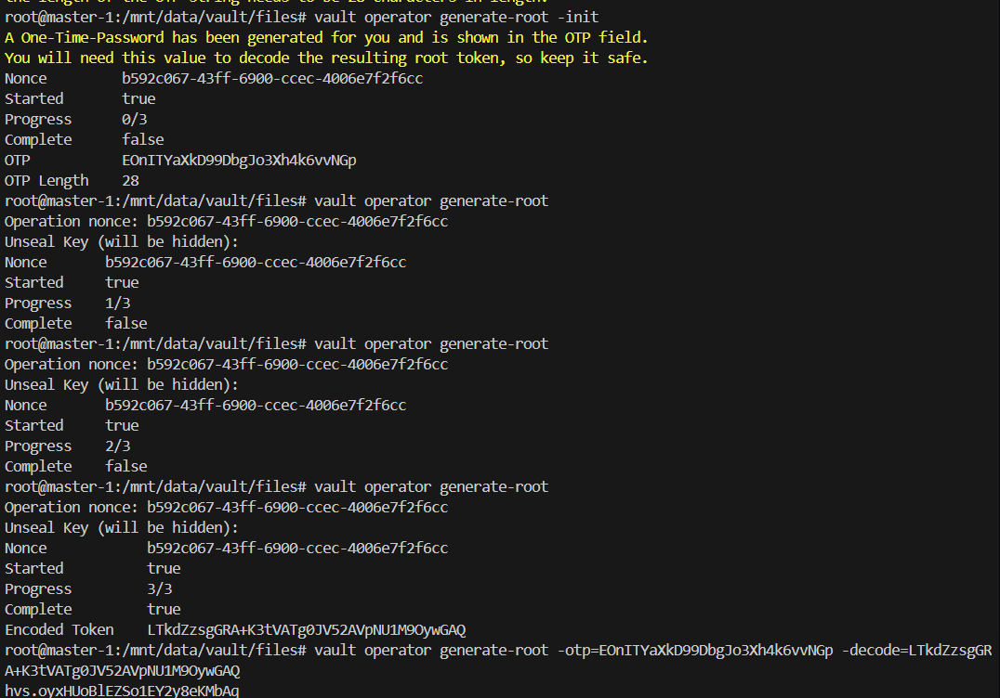
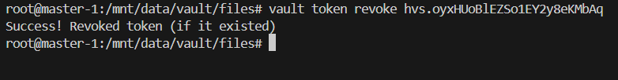

# Root token

Root tokens are the token with root privileges in the vault anyone with the root token is free to do whatever he/she/it want to do on the vault. delete any secret disable a authentication method or secret engine, seal the vault and so on. also these token never expire so as lon as it lives the vault is vulnerable and prone to compromised.

hence the root token should be revoked and recovered when it is required.

## Re-generating the root token

What we are aiming for is that there are no active token with root privileges but we do need a token which can generate a root token in case of crisis.

A policy with minimal access to generate a root token.

```hcl
path "sys/generate-root/attempt" {
  capabilities = ["create", "update", "read", "sudo"]
}

path "sys/generate-root/update" {
  capabilities = ["create", "update", "read", "sudo"]
}

path "sys/generate-root/attempt/*" {
  capabilities = ["read", "sudo"]
}

path "sys/generate-root/status" {
  capabilities = ["read", "sudo"]
}
```



> login with new token
```bash
vault login
```



> Root token generation

1. start the process of generating the root

    ```bash
    vault operator generate-root -init
    ```
    take a note of otp it will be required to decode the generated token

2. pass the seal keys

    ```bash
    vault operator generate-root
    ```
    once completed a encoded token is generated share it with the person having otp generated in first step.

3. use otp to decode the token

    ```bash
    vault operator generate-root -otp=<otp> -decode=<encoded_token>
    ```
    

4. Revoke the root

    once crisis is completed revoke the root

    ```bash
    vault token revoke <token>
    ```
    