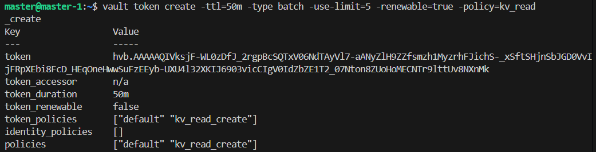
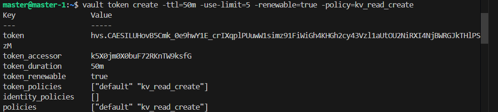
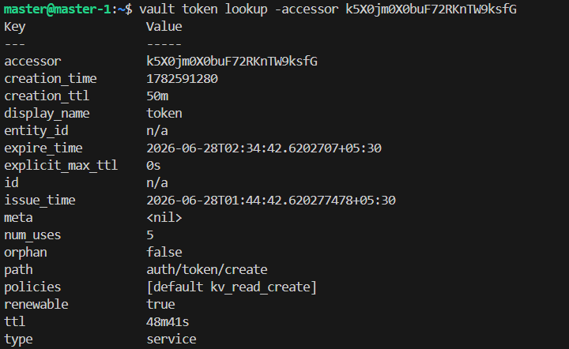

# Service Tokens vs Batch Tokens

Service and Batch tokens are main 2 types of tokens which are used by applications. 

The major difference between these token types is whether they are stored in Vault's storage backend.
By default any token is created it is of type service and they are stored in vault storage backend and access via accessor so whenever a request authenticated with a service token reaches Vault, Vault validates the token against its token store. Since service tokens are persisted in the storage backend, this validation involves reading the token entry maintained by Vault. This increase latency and creates pressure on vault. Here Batch token wins they are not stored in vault storage backend or any ram, so how do vault know is token is valid or not or which policies are applied to it ? Batch tokens are self-contained. They are cryptographically signed and contain the information required for Vault to validate them, such as policies, TTL, and other metadata. Therefore Vault does not need to perform a storage lookup to authenticate them and hence the size of these token are larger than service token they best fit for backend application or some ETL or Cronjob which require to access secret from vault more frequently. Not only that batch token are best suited for Disaster recovery and replication as there is no no need to reconfirm the token validity from primary vault process.

> Batch Token

as you can see there is no accessor because they are not stored in backend.

they are not renewable as vault does not track them so it cannot increase their leases.

> Service Token

Because service token are stored in storage backend they have an accessor attached to it. this accessor is later used to access the token information aka lookup or revoke the token without revealing its value.

Note this token is tracked so it can be renewed granted done before expiry.

***although these token are granted a duration and made periodic in nature they will expire after 5 uses because use-limit is assigned***

## limit token usage 

> use limit

when an administration task is done and a token is shared with a team to run known/counted number of operations it is advised to use-limit as it auto revokes the tokens once the limit is exhausted.

num_uses follow the following function

1. N>0 i.e. number of times token can be used
2. -1, 0 i.e. indicating the token created has no usage operational limit and can be used unlimited times until the lease is revoked.

> This is how accessor is used to get information about the specific token.

