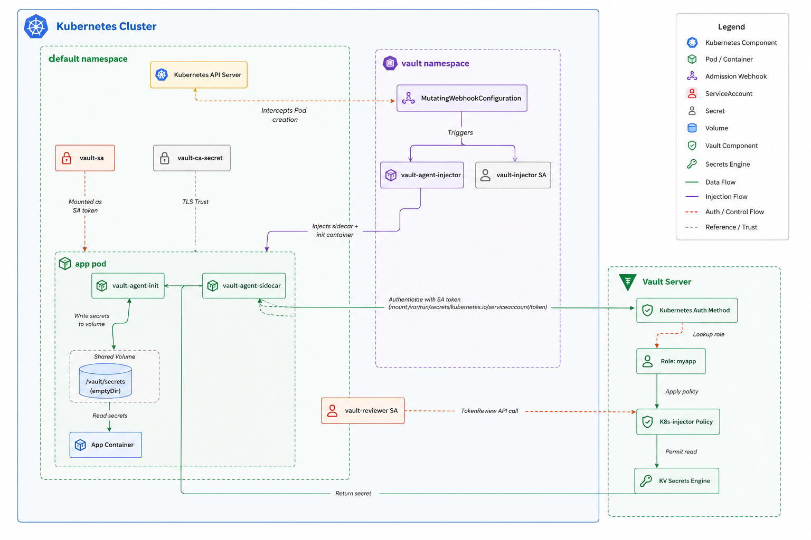
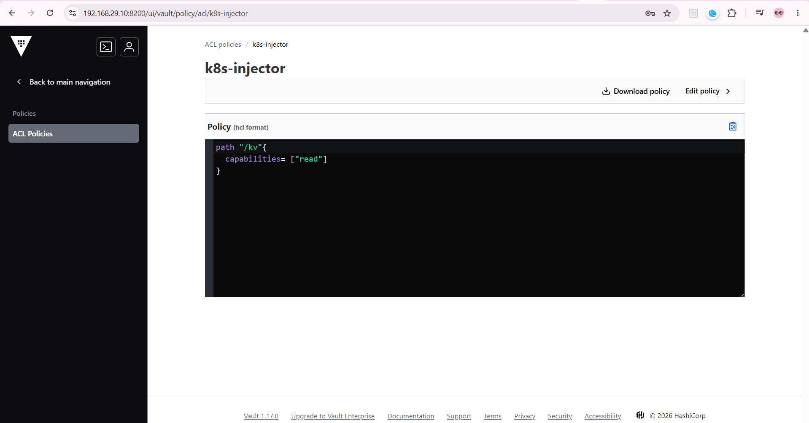
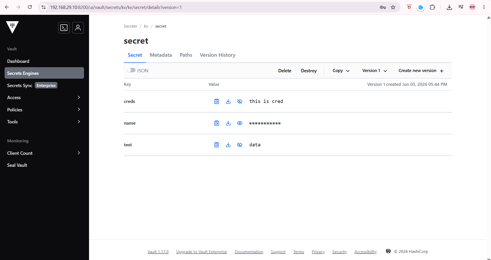
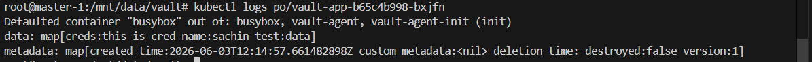

# Kubernetes authentication agent injector

## architecture of what we are building



## create secret with tls certficate used to validate vault
kubectl create secret generic vault-ca --from-file=ca.crt=/etc/vault.d/vault-cert.pem

## install the agent injector from helm 
> to add the hashicorp official charts
```bash 
helm repo add hashicorp https://helm.releases.hashicorp.com
```
> to get a local pull and study the values file
```bash
helm pull hashicorp/vault 
```
> install agent injector with values files
```bash
helm install vault-injector hashicorp/vault --namespace vault --values ./values.yaml
```

refrence values.yaml is defined in `.\agent_injector_manifests\values.yaml`

## create reviewer service account and token

> this service account is used to login into the vault and verify the connection
```bash
kubectl create serviceaccount vault-reviewer
REVIEWER=$(kubectl get secret vault-reviewer-token -o jsonpath='{.data.token}' | base64 -d)
```
this Reviewer token will be used in kubernetese auth config

Note: If not done properly 403 permission denied errors will pop in vault-agent-init

## enable kubernetes authentication mechanism

```bash
vault auth enable kubernetes

vault write auth/kubernetes/config \
  kubernetes_host="https://192.168.29.10:6443" \
  kubernetes_ca_cert=@/mnt/data/k3s/server/tls/server-ca.crt \
  token_reviewer_jwt="$REVIEWER" \
  disable_local_ca_jwt="true"
```
> disable_local_ca_jwt,  tells vault it is not in k8s cluster and should not look for local ca and jwt. thats why we are providing the serviceaccount jwt and and k8s apiserver Certificate to authenticate and establish connection between vault and k8s. 


## create role and policy
>policy


> Role:
```bash
vault write auth/kubernetes/role/myapp \
  bound_service_account_names=vault-sa \
  bound_service_account_namespaces=default \
  policies=k8s-injector \
  ttl=1h \
  audience="k3s" \
  alias_name_source="serviceaccount_name"
```
## create secret in vault


## create a test app and its service account

> use deployment.yam to create a deployment

Important annotations

```yaml
      annotations:
        vault.hashicorp.com/agent-inject: "true"
        vault.hashicorp.com/role: "myapp"
        vault.hashicorp.com/agent-inject-secret-mysecretfile: "kv/data/secret"
        vault.hashicorp.com/tls-secret: "vault-ca"
        vault.hashicorp.com/ca-cert: "/vault/tls/ca.crt"
```



##### agent_injector_manifest

- values.yaml used in helm install [values.yaml](./agent_injector_manifests/values.yaml)
- deployment.yaml [deployment.yaml](./agent_injector_manifests/deployment.yaml)
- token_reviewer 
    - create serice_account using `kubectl create sa <serviceaccount_name> -n <namespace>`
    - Role [tokenreviewer_role](./agent_injector_manifests/clusterrolebinding.yaml)
    - Secret [token_Secret](./agent_injector_manifests/secret.yaml)
