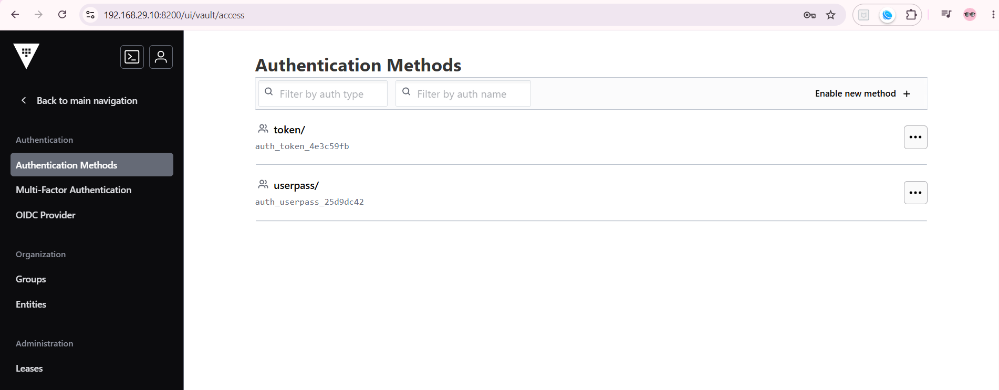
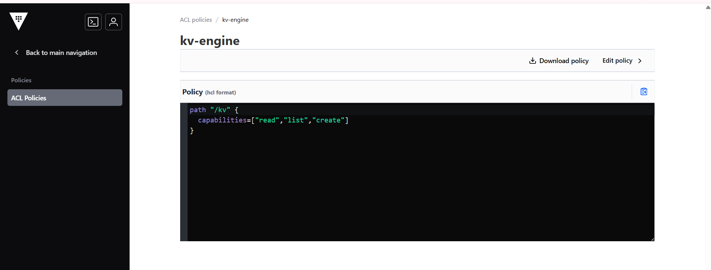
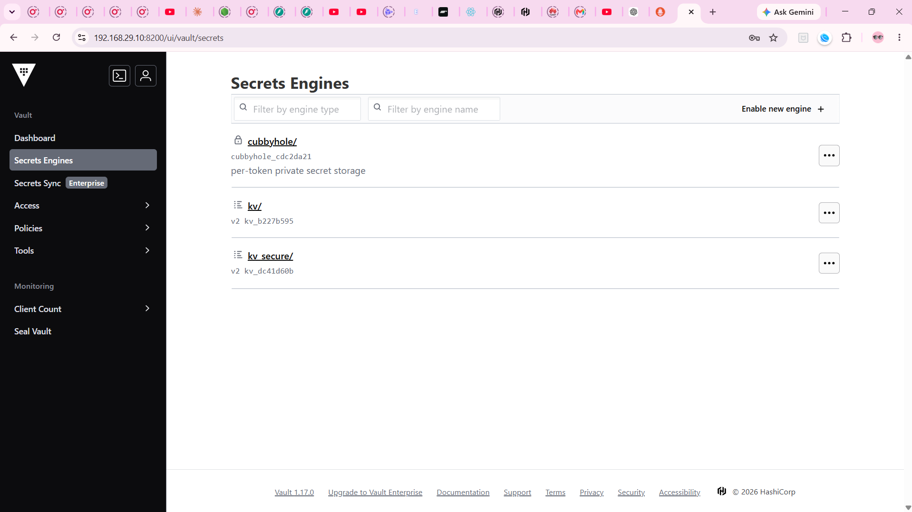
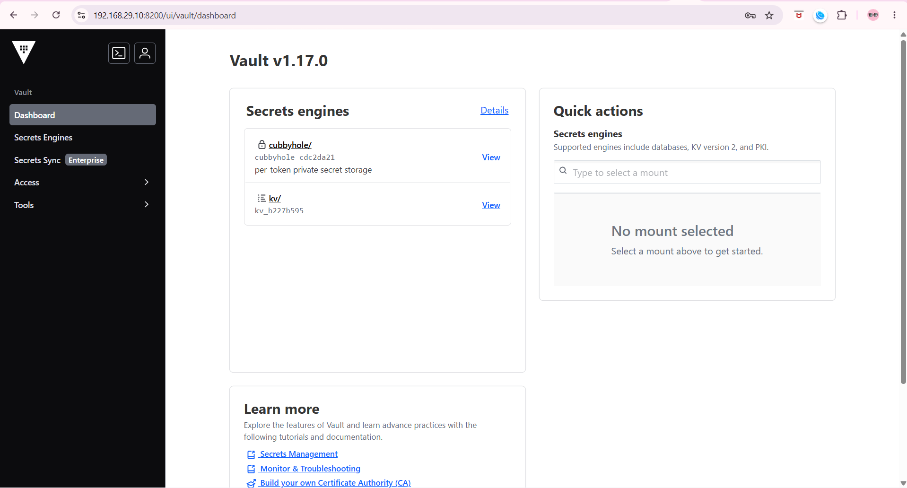

# UserPass authentication

> Till now we were using the token for authentication on vault which is default mechanism but this is not recommended for users as no one gonna remember these tokens so we will use username and password.

### vault auth help 

to see basic auth commands
i.e. 
- enable 
- disable
- help 
- list
- move
- tune
```bash
vault auth --help
```

### check which auth methods are enable
```bash
vault auth list
```
**Output:**
```
Path      Type     Accessor               Description                Version
----      ----     --------               -----------                -------
token/    token    auth_token_4e3c59fb    token based credentials    n/a
```

### to see basic usage of authentication method
```bash
vault auth  help userpass
```
**Output:**
```
Usage: vault login -method=userpass [CONFIG K=V...]

  The userpass auth method allows users to authenticate using Vault's
  internal user database.

  Authenticate as "sally":

      $ vault login -method=userpass username=sally
      Password (will be hidden):

  Authenticate as "bob":

      $ vault login -method=userpass username=bob password=password

Configuration:

  password=<string>
      Password to use for authentication. If not provided, the CLI will prompt
      for this on stdin.

  username=<string>
      Username to use for authentication.
```

### enable the authentication method 

as we have seen only token authentication method is enabled till now
```bash
vault auth enable userpass
```


```
Success! Enabled userpass auth method at: userpass/
```

> now auth method is enabled

```bash
vault auth list
```
**Output:**
```
Path         Type        Accessor                  Description                Version
----         ----        --------                  -----------                -------
token/       token       auth_token_4e3c59fb       token based credentials    n/a
userpass/    userpass    auth_userpass_25d9dc42    n/a                        n/a
```

### creating the user

before creating the user create the acl policy that user needs to be associated. this make sure the user created has least privilage or minimal access. 


Default acl policy is attached to all by default.

```bash
 vault write auth/userpass/users/sachin password="pass@123" policies="kv-engine"
```
**Output:**
```
Success! Data written to: auth/userpass/users/sachin
```

### user Login

exported VAULT_TOKEN takes precedince we were working on cli using root till now even if we do login it will not impact as root token will be used for request. so unset the value first. 

```
WARNING! The VAULT_TOKEN environment variable is set! The value of this
variable will take precedence; if this is unwanted please unset VAULT_TOKEN or
update its value accordingly.
```
```bash
 export VAULT_TOKEN=""
```

#### To verify that root is logged out active
``` bash
 vault read /auth/userpass/users/sachin
```
**Output:**
```
Error reading auth/userpass/users/sachin: Error making API request.

URL: GET https://192.168.29.10:8200/v1/auth/userpass/users/sachin
Code: 403. Errors:

* 1 error occurred:
        * permission denied
```

```bash
vault login -method=userpass username=sachin
Password (will be hidden): 
```
**Output:**
```
Success! You are now authenticated. The token information displayed below
is already stored in the token helper. You do NOT need to run "vault login"
again. Future Vault requests will automatically use this token.
Key                    Value
---                    -----
token                  hvs.CAExxxxxxxxxxxxxxxxxxxxxxxxxxxxxxxxxxx
token_accessor         n4TK5lzTXciWLbB41mzXwyFz
token_duration         768h
token_renewable        true
token_policies         ["default" "kv-engine"]
identity_policies      []
policies               ["default" "kv-engine"]
token_meta_username    sachin
```

> A temperory token is created and registered by default internal all authentication methods generate a token to authenticate but these are shortlived and session based. on each login new temporary token is created. even when logged in via UI

>this token gets stored at 
```bash
cat ~/.vault-token
hvs.CAESIN6a1Y2GPdtmtKzbz4YA5HlbNewryLfKE1HR-mjMiwTjGh4KHGh2cy5aNUR3UDlWaEYwYUphNUVjcFZBS2hUREoroo
```
until logged out.

## limited user access as per the policy

> user get access to /kv path based on the policy attached not kv_secure whereas root can see it all.

policy


root access


user access
