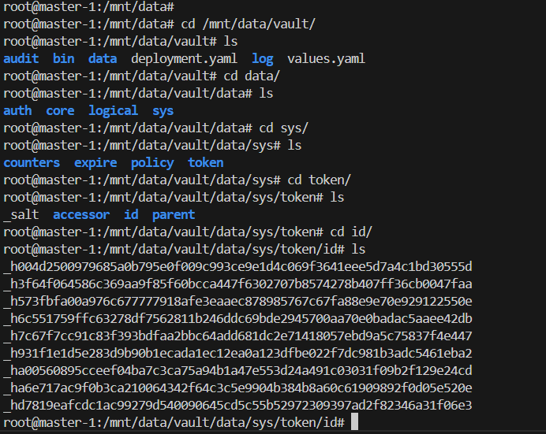
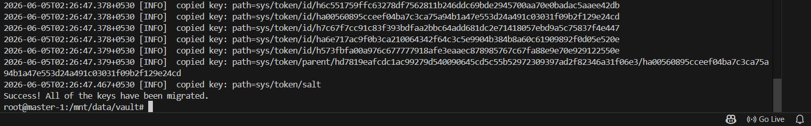

# Migrating Storage Backend

>  what we are doing and why ??

Currently we are using filesystem as backened storage that means we are writting everything ti disk which is highly insecure and only okay in dev setups.

So we are going to transfer the data from filesystem to mysql server. where only vault user has acces to backend and noone else. 

Cons-> it create a dependency on mysql server meaning server must be healthy for vault to be alive.

>Currently data written in filesystem



## Mysql Configuration

> we are not gonna expose this mysql server as it is protected so running on localhost is good. 
> As we are doing on rasberry pie and lots of write on sd card can make the sdcard wear out and shorten its lifespan. hence default /var/lib/mysql/  unsuitable for our cause.

### make sure mysql write write in hard disk or ssd instead of sd card

- step1
update `/etc/mysql/mysql.conf.d\ mysqld.cnf` with new data directory
```bash
datadir = "/mnt/data/mysql"
```

- step2 
update the appArmour config at `/etc/apparmor.d\usr.sbin.mysqld` to grant permission to our new directory
```bash
# Allow data dir access
  /mnt/data/mysql/ r,
  /mnt/data/mysql/** rwk, 
```

and grant ownership to mysql user

```bash
chown -R mysql:mysql /mnt/data/mysql/
```

- step 3 

re-initialize the mysql server
``` bash
mysqld --initialize
```

- step 4 restart the server
``` bash
systemctl restart mysql
```
> you will get locked out and root will not be able to login without password so use the following to get temporary password.
``` bash
root@master-1:/mnt/data# mysql
ERROR 1045 (28000): Access denied for user 'root'@'localhost' (using password: NO)

grep "temporary password" /var/log/mysql/error.log
```
and use the password to login 

```bash
mysql -u root -p
```

>reset password

```sql
ALTER USER 'root'@'localhost'
IDENTIFIED BY 'zqf6aEHi!cup';
```

------- Now your mysql is writting into the hardisk/ssd instead of default -----------

## create db and user inside mysql where vault data will be stored

```sql
CREATE DATABASE vault;

create user 'vault'@'localhost'
IDENTIFIED BY 'vault-pass';


CREATE ROLE 'vault_role';

GRANT ALL PRIVILEGES ON vault.* TO 'vault_role';

GRANT 'vault_role' TO 'vault'@'localhost';

SET DEFAULT ROLE `vault_role`@`%`
TO `vault`@`localhost`;
```

## stop the vault
```bash
systemctl stop vault
```

## create migration.hcl file
vault migration.hcl file
```hcl
storage_source "file"{
    path = "/mnt/data/vault/data"
}

storage_destination "mysql"{
  address  = "127.0.0.1:3306"
  username = "vault"
  password = "vault-pass"
  database = "vault"
}
```
```bash
vault operator migrate -config=migration.hcl
```


## update the vault.hcl

```hcl
#storage "file" {
#  path = "/mnt/data/vault/data"
#}

storage "mysql" {
  username = "vault"
  password = "vault-pass"
  database = "vault"
  address  = "127.0.0.1:3306"
}
```

## restart vault and verify

```bash
systemctl start vault
```


> unseal the vault
```bash
vault operator unseal
```


## inside the mysql server
> vault table
